# learn plotters

## Contents

ディレクトリ中の`<src_name>.rs`を実行するには

```bash
$ cargo run --bin <src_name>
```

とする。

画像ファイルを生成する場合では`target/figure` \*.pngファイルが生成される。

### windowに埋め込む(realtimeのみ違う) 

1. real\_time.rs: リアルタイムにカウントダウンを描画 


2. plot\_1.rs: 色々な関数をplotできるようにした 
3. many\_plot.rs: 多くのplotを重ね書きする
4. scatter.rs: 散布図

### basics

基本的な機能を試す

1. line.rs: 直線だけを描画する
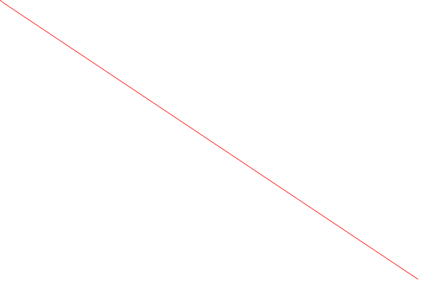

2. mesh.rs: meshだけを描画する
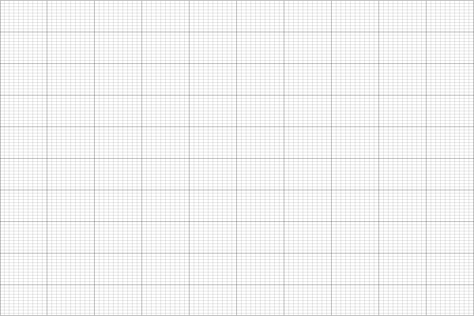

3. axes.rs: meshと軸だけ描画する
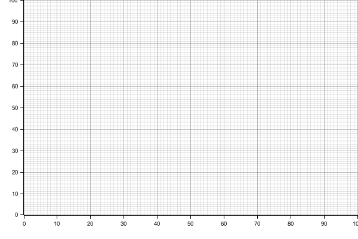

4. title.rs: mesh + 軸 + タイトル 
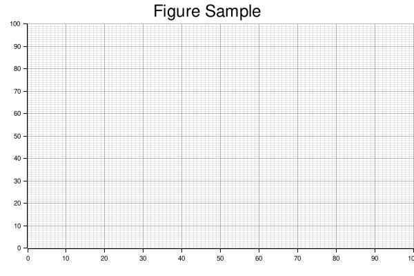

5. line\_series.rs: 簡単な曲線のplot 
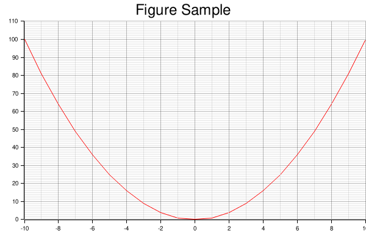

6. legend.rs: 曲線のplotに凡例を付ける
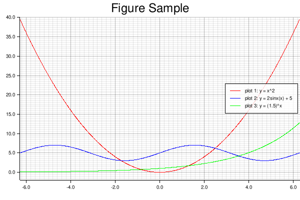

7. scatter.rs: 散布図
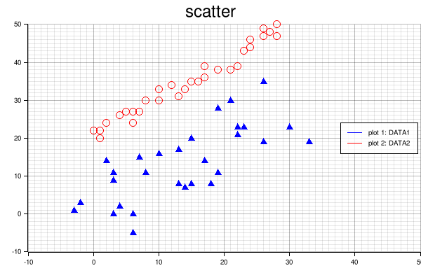

8. area\_chart.rs: エリアチャート
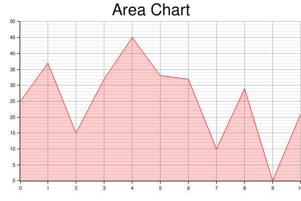

9. histogram.rs: ヒストグラム
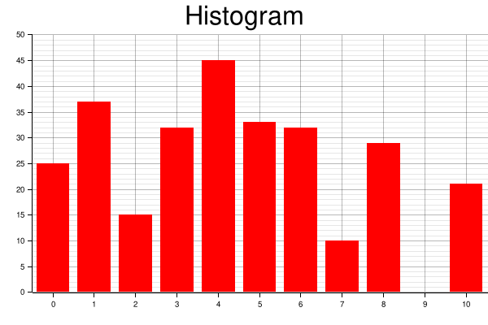

### 3d

3d plotの機能を試す

1. axes\_3d.rs: 三次元の軸のみ描画
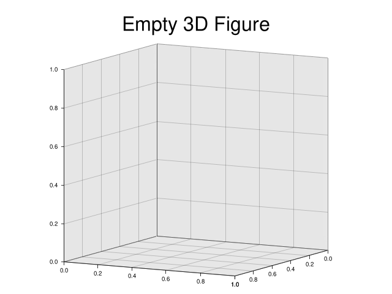

2. line\_3d.rs: 三次元座標中に曲線を描画
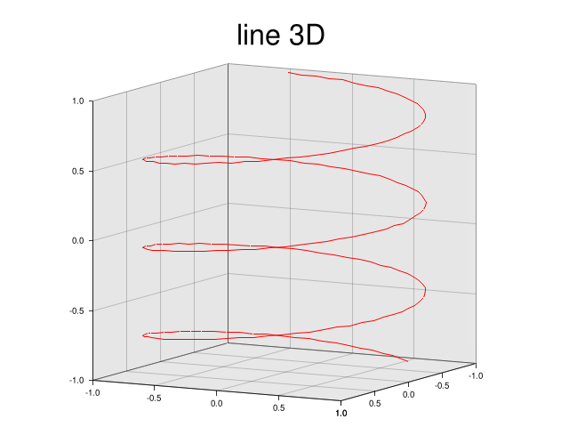

3. surface\_3d.rs: 三次元座標中に曲面を描画
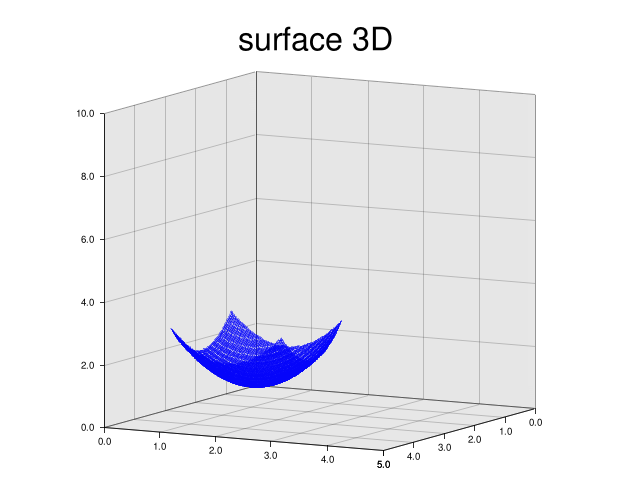

4. line\_3d\_perspective: 三次元座標の視点の調整
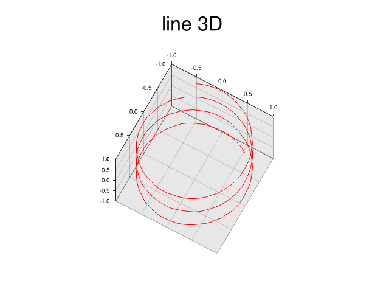
