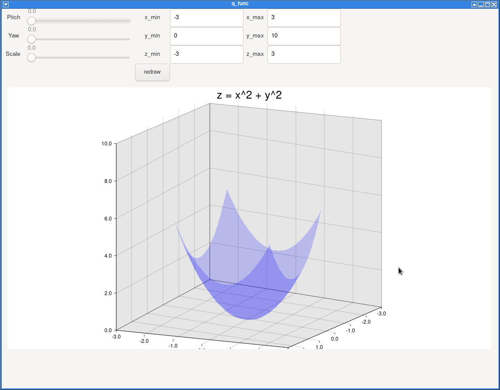
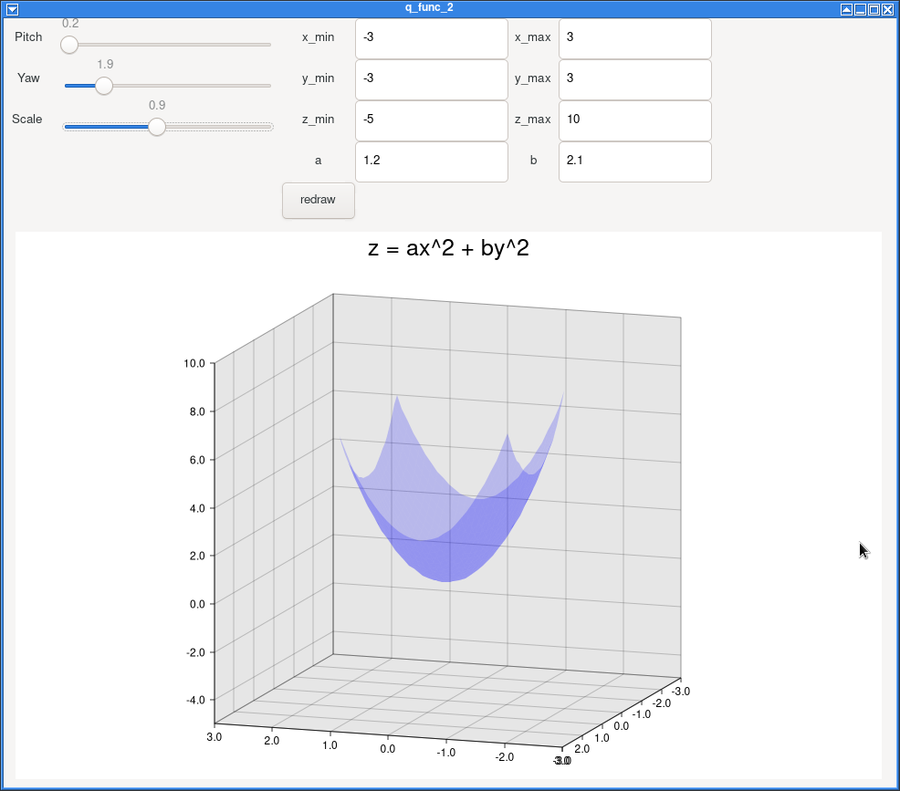

# simple plot

## Contents 

ディレクトリ中の`<src_name>.rs`を実行するには

```bash
$ cargo run --bin <src_name>
```

とする。

1. q\_func.rs: $z = x^2 + y^2$ の3dプロットの視点、描画範囲を調節できるようにした。


2. q\_func\_2.rs: $z = ax^2 + by^2$ の3dプロットの視点、描画範囲、パラメータ $a,b$ を調節できるようにした。 

