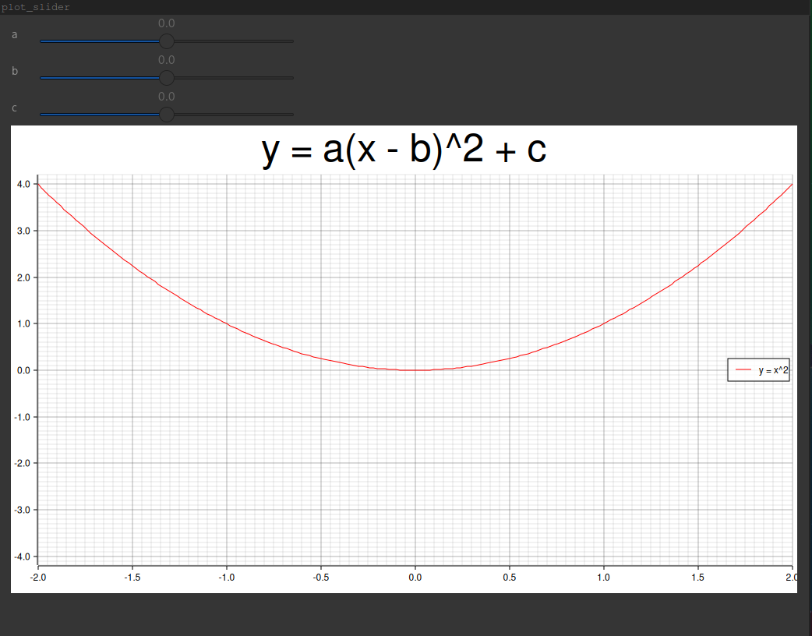
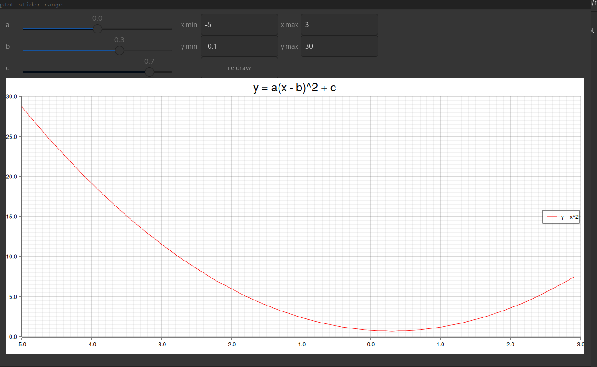

# simple plot

## Contents 

ディレクトリ中の`<src_name>.rs`を実行するには

```bash
$ cargo run --bin <src_name>
```

とする。

1. plot\_slider.rs: 二次関数 $y = a(x - b)^2 + c$ のパラメータ $a,b,c$ をスライダーから変化させて再描画する


2. plot\_slider\_range.rs: 二次関数のパラメータだけでなく、描画範囲もGUIから変化させられるようにした。 

