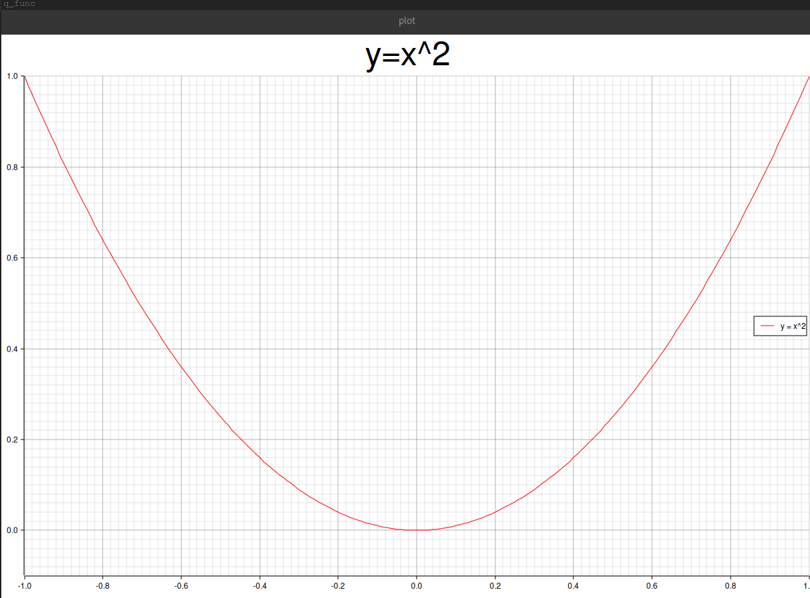

# simple plot

## Contents 

ディレクトリ中の`<src_name>.rs`を実行するには

```bash
$ cargo run --bin <src_name>
```

とする。


1. plot\_fig.rs: 二次関数をplotして\*.png画像を出力する。
2. demo.rs: 環境のチェック用に[デモコード](https://github.com/sdroege/plotters-gtk-demo/tree/master/src)を自分の環境でビルドした。
3. quadratic\_func.rs: 二次関数のplotを`GtkWindow`中の`GtkDrawingArea`に埋め込んだ。


